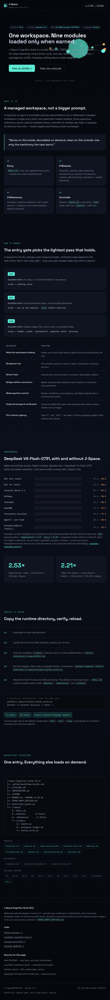
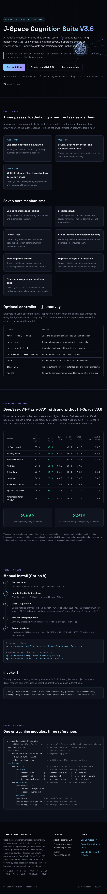

# deep-fable

[](https://github.com/aryrabelo/deep-fable/actions/workflows/test.yml)
[](https://skills.sh/aryrabelo/deep-fable)
[](LICENSE)

An OMP profile that boots every session into the J-Space inner-workspace discipline, running on DeepSeek — plus the benchmark that motivated putting DeepSeek in that seat.

No harness, no state machine. A profile: a system prompt append, a model default, and a vendored skill.

## Install the skill — one command, no clone

```bash
npx skills add aryrabelo/deep-fable
```

That is the [skills.sh](https://www.skills.sh) CLI ([vercel-labs/skills](https://github.com/vercel-labs/skills)).
It clones the repo, finds `j-space`, and installs it for the agents it detects. Useful forms:

```bash
npx skills add aryrabelo/deep-fable              # project-level, auto-detected agent
npx skills add aryrabelo/deep-fable --global     # user-level, every session
npx skills add aryrabelo/deep-fable -a claude    # one specific agent
npx skills add aryrabelo/deep-fable --list       # see what it found, install nothing
npx skills add aryrabelo/deep-fable --copy       # copy instead of symlinking
```

It symlinks into each agent's skills directory by default, and edits no config file. Verified
against CLI v1.5.23: `--list` against this repo reports exactly one skill, `j-space`, with the
full description.

**It installs skills only — not the `/deep-fable` slash command.** The skills.sh CLI has no
command/prompt handling at all (there is no `commands/` code path in its source). For the
command, use `./install.sh` below, or copy the one file:
`cp .omp/commands/deep-fable.md ~/.omp/agent/commands/`.

## Install the profile

```bash
git clone https://github.com/aryrabelo/deep-fable.git
cd deep-fable
./install.sh
```

`install.sh` builds `~/.omp/profiles/jspace/agent/` from `profile/`, vendors `.omp/skills/j-space` into it, and registers the `deep-fable` alias. It **never bundles credentials** — no keys, no `.env`, no `agent.db` are copied. After install, authenticate OpenRouter yourself: set `OPENROUTER_API_KEY` in your shell, or run `omp` login and follow its prompts.

## Use

```bash
deep-fable
# or, without the alias:
omp --profile jspace
```

Every session starts by reading `skill://j-space` and operating under it, on
`openrouter/deepseek/deepseek-v4-flash-0731` at `max` thinking.

### Without the profile

The profile is only three things — a model default, a thinking default, and a system-prompt
append — and all three are plain flags:

```bash
# same behaviour, no profile, no alias
omp --model openrouter/deepseek/deepseek-v4-flash-0731 --thinking max \
    --append-system-prompt profile/APPEND_SYSTEM.md

# or let the config do the model, keeping your own thinking level
omp --config profile/config.yml
```

`--append-system-prompt` takes a file path and appends the contents verbatim.

To get the skill in **every** OMP session in any directory, with no profile and no flags,
install it to the shared Agent Skills path — one copy also serves Codex CLI, Cursor, and
Gemini CLI:

```bash
./install.sh agents     # -> ~/.agents/skills/j-space
```

Then plain `omp` discovers it from the skill's description. Verified: invisible outside the
repo before that install, visible after. Undo with `rm -rf ~/.agents/skills/j-space`.

### `/deep-fable` — on demand, mid-session

`deep-fable` in your shell is the alias (a zsh function running `omp --profile=jspace`), and
it loads the skill at boot. `/deep-fable` is different: a slash command that establishes the
J-Space workspace whenever you want it, in a session that started normally.

```
/deep-fable refactor this module without breaking callers
```

It reads `skill://j-space`, classifies the task, routes to the module the skill names, then
stays under that discipline for the rest of the session. Verified without the profile:
the command reported reading `.omp/skills/j-space/SKILL.md` and assigned a pass level.

It ships in `.omp/commands/deep-fable.md`, so it works inside this repo, and `./install.sh`
copies it into the profile, so it also works in every `deep-fable` session. For it in *every*
OMP session anywhere, copy that one file to `~/.omp/agent/commands/` — `./install.sh agents`
prints the exact command.

## Other coding agents

The skill itself is agent-agnostic — no OMP-specific syntax anywhere in it. Every major
coding agent installs today:

```bash
./install.sh agents     # -> ~/.agents/skills/j-space   (shared: OMP + Codex + Cursor + Gemini)
./install.sh claude     # -> ~/.claude/skills/j-space
./install.sh codex      # -> ~/.agents/skills/j-space
./install.sh opencode   # -> ~/.config/opencode/skills/j-space
./install.sh cursor     # -> ~/.cursor/skills/j-space
./install.sh gemini     # -> ~/.gemini/skills/j-space   (no extension bundle needed)
```

No adapter edits your config. Each copies the skill and prints the optional always-on
snippet for you to paste — model choice stays with your agent's own settings.

| Agent | Install | Discovery verified |
|---|---|---|
| OMP | ✅ `./install.sh` / `./install.sh agents` | ✅ fires unprompted |
| Claude Code | ✅ `./install.sh claude` | ✅ fires unprompted |
| Codex CLI | ✅ `./install.sh codex` | ✅ fires unprompted |
| OpenCode | ✅ `./install.sh opencode` | ⚠️ loads, but competes with your other skills |
| Cursor | ✅ `./install.sh cursor` | ⏸ no Cursor CLI to test with |
| Gemini CLI | ✅ `./install.sh gemini` | ⚠️ listed as enabled; live turn blocked by API key |

In-repo the skill lives once at `.omp/skills/j-space`; `.agents/skills/j-space` is a symlink
to it, and that single path is read natively by OMP, Codex CLI, Cursor, and Gemini CLI. Full
support matrix and the verified sources behind each install path: [ROADMAP.md](ROADMAP.md).

## Does the skill actually work?

Unknown, and this repo says so out loud. Nothing measured here yet shows that J-Space changes
coding outcomes: Round 1 was a ceiling effect, Round 3's verdict is unreproduced, Round 4
measured adapter integration. Upstream's claimed +7 to +16pp gains ship with no harness, no
seeds, no run counts and no confidence intervals.

[`docs/BENCHMARKS.md`](docs/BENCHMARKS.md) is the honest accounting, and `bench/` is the
harness built to settle it:

| | what it is | scope |
|---|---|---|
| [`bench/aider_polyglot/`](bench/aider_polyglot/) | 225-exercise polyglot set, 3 arms, McNemar exact test | the efficacy vehicle — ~200 paired tasks are what a 10pp effect needs |
| [`bench/terminal_bench/`](bench/terminal_bench/) | omp adapter for Terminal-Bench, 12-task subset | harness validation and cost calibration only — 12 tasks detect ~36pp at best |
| [`bench/arms/`](bench/arms/) | `jspace` / `none` / `placebo` | the placebo is token-matched per file against every j-space file, worst delta 0.43% |

Three arms, not two: filler tokens alone can raise scores ([Pfau et al. 2024](https://arxiv.org/abs/2404.15758)),
so without a length-matched control a win cannot be told apart from "a longer prompt helps".

## Why DeepSeek

Two rounds of fair-comparison benchmarking (`model-eval/`) before picking a default.

**Round 1 — 5 models × effort levels × 6 real maintenance tasks × 3 runs, deterministic held-out acceptance, no LLM judge.** 234/234 PASS. Every model, every effort level, every run — a ceiling. Effort level produced no measurable difference at this task size. Verdict: choose on cost, not correctness. Full report: [`model-eval/REPORT.md`](model-eval/REPORT.md).

**Round 3 — opus:medium vs deepseek:max, a five-stage creative landing-page build, blind human A/B.** Both cells 12/12 on the objective checker, clean render, zero console errors. The human judge broke the tie narrowly toward opus ("quase um empate mas a X tá melhor") — while deepseek finished ~3 minutes faster at a cost of cents. Full report: [`model-eval/round3/REPORT.md`](model-eval/round3/REPORT.md).

> **This verdict is unreproduced and should not be cited.** Round 3 pinned models with
> `agent(prompt, { model })` in the JS eval kernel, and Round 4 found that option is silently
> ignored — a bogus model id raised no error, and both supposedly-pinned cells self-reported
> `claude-sonnet-5`. Both arms were most likely the same model running the same prompt twice.
> Model pinning now goes through separate `omp` processes with `--model`, which fails loudly on
> a bad id. See [`docs/BENCHMARKS.md`](docs/BENCHMARKS.md) §1.

| | `claude-opus-5:medium` | `deepseek-v4-flash-0731:max` |
|---|---|---|
| Objective checks | 12/12 | 12/12 |
| Console errors | 0 | 0 |
| Wall time | ~18 min | ~15 min |
| Blind A/B | won, narrowly | lost, narrowly |
| Cost | reserve-tier | cents |

<p align="center">
  
  
</p>
<p align="center"><sub><b>Left:</b> claude-opus-5:medium &nbsp;·&nbsp; <b>Right:</b> deepseek-v4-flash-0731:max</sub></p>

DeepSeek doesn't clearly lose. It clearly costs less. That's the whole case for the default.

## Layout

```
deep-fable/
├── README.md
├── ROADMAP.md               # support matrix, verified install paths with sources
├── LICENSE
├── .gitignore
├── install.sh               # ./install.sh [omp|claude|codex|opencode|cursor|gemini]
├── profile/
│   ├── config.yml           # modelRoles.default: deepseek-v4-flash-0731, defaultThinkingLevel: max
│   └── APPEND_SYSTEM.md     # boot instruction: read skill://j-space, operate under it
├── .omp/skills/j-space/     # vendored J-Space Cognition Suite (Apache-2.0, see LICENSE)
├── .agents/skills/j-space   # symlink -> .omp/skills/j-space (OMP / Codex / Cursor / Gemini)
├── adapters/                # per-agent installers: claude, codex, opencode, cursor, gemini
├── .github/workflows/       # CI: pytest on push and pull_request
├── model-eval/              # benchmark harness, briefs, reports (rounds 1, 3, 4)
│   ├── round3/
│   └── round4/
├── jspace-eval/             # J-Space-specific eval tasks and verifier
├── bench/                   # three-arm efficacy harness (see docs/BENCHMARKS.md)
│   ├── arms/                # jspace / none / placebo, incl. the token-matched placebo skill
│   ├── aider_polyglot/      # 225 exercises, McNemar exact test, length-control gate
│   ├── terminal_bench/      # omp adapter + 12-task calibration subset
│   └── results/             # raw results JSONL, committed on purpose
├── tests/                   # pytest for install.sh / adapters / repo hygiene / arms
├── docs/BENCHMARKS.md       # what is measured, what is not, and the power arithmetic
└── docs/images/             # benchmark screenshots
```

## Credit

- **J-Space Cognition Suite V3.6** by [Tiger3807861189](https://github.com/Tiger3807861189/J-Space-Cognition-Suite-V3.6) — vendored under `.omp/skills/j-space`, Apache License 2.0.
- Repo shape inspired by [duolahypercho/gauntlet-loop](https://github.com/duolahypercho/gauntlet-loop).

## License

MIT for this repository's own code — see [LICENSE](LICENSE). `.omp/skills/j-space` remains Apache-2.0 under its upstream license.
